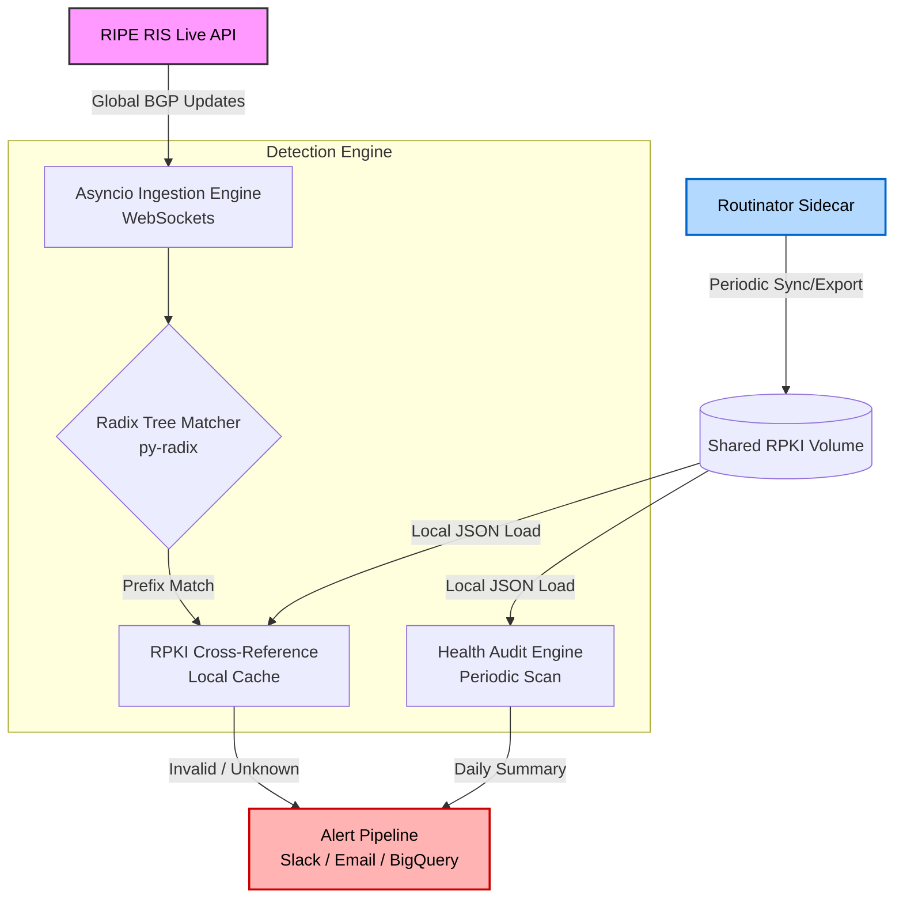

# RPKI-Guardian


In modern network infrastructure, Border Gateway Protocol (BGP) vulnerabilities remain one of the most critical attack vectors. A single malicious route announcement or accidental route leak can reroute entirely legitimate traffic, leading to data interception or devastating blackhole events.

**RPKI-Guardian** is a high-performance, real-time Python detection engine designed to identify BGP origin hijacks and sub-prefix hijacks the millisecond they propagate globally. By combining direct WebSocket streams from the RIPE RIS Live API with extremely fast Radix tree lookups and local RPKI cryptovalidation, this tool provides zero-latency visibility into the security of your publicly routable IPv4 and IPv6 assets.

---

## Architecture

The monitor is designed for asynchronous, non-blocking throughput. It ingests the global BGP table stream, cross-references it against your configured IP assets using a C-optimized Radix tree, and validates anomalies against local RPKI cryptographic material provided by an automated **Routinator Sidecar**.



---

## Core Features

*   **Real-Time Global Streaming:** Ingests live BGP updates directly from the RIPE Routing Information Service (RIS).
*   **Sub-Prefix Hijack Detection:** Utilizes $O(k)$ longest-prefix matching to catch sophisticated sub-prefix attacks (e.g., a malicious `/24` announced within your protected `/22`).
*   **Automated RPKI Sidecar:** Includes a built-in `routinator` service that handles TAL management and cryptographic validation automatically.
*   **RPKI Health Auditing:** Periodically scans all configured assets and generates a report identifying missing ROAs or configuration mismatches.
*   **Intelligent Alerting:** Features a 24-hour deduplication cooldown for both security events and health summaries to prevent alert fatigue.
*   **Multi-Channel Exporters:** Push high-signal security alerts via Slack (Webhooks), SendGrid (Email), or archive them in Google Cloud BigQuery for long-term audit compliance.

---

## Configuration

Your protected IP assets and alerting parameters are defined in `config.json`.

```json
{
  "rpki_cache_path": "/data/rpki/routinator_roas.json",
  "alerting": {
    "log_level": "INFO",
    "chat_webhook": "https://chat.googleapis.com/v1/spaces/..."
  },
  "sendgrid": {
    "enabled": true,
    "api_key": "SG.xxx",
    "from_email": "alerts@domain.com",
    "to_email": "admin@domain.com"
  },
  "bigquery": {
    "enabled": false,
    "project_id": "your-gcp-project"
  },
  "monitored_assets": [
    {
      "prefix": "192.0.2.0/24",
      "expected_asn": 64496,
      "description": "Primary Anycast Edge"
    }
  ]
}
```

---

## Quick Start

**1. Configure your assets and webhook:**
```bash
cp config.example.json config.json
# Edit config.json with your prefixes and Chat Webhook URL
```

**2. Deploy the stack:**
```bash
docker-compose up -d --build
```

**3. Monitor logs:**
```bash
# Watch BGP events
docker-compose logs -f bgp-monitor

# Watch RPKI sync status
docker-compose logs -f routinator
```

---

## Alert Examples

When a hijack is detected, you will receive a notification in your alerting channels:

> 🚨 **BGP SECURITY ALERT**
> **Type:** SUB-PREFIX HIJACK
> **Asset:** Primary Edge
> **Event:** 1.2.3.0/24 by AS666
> **Expected:** 1.2.0.0/16 via AS123
> **RPKI:** INVALID (Origin AS does not match ROA)
> **Stats:** Seen 1 times (Cooldowned for 24hrs)

---

## Security Considerations

*   **Secrets Management:** Never commit your `config.json` to source control. It is already added to `.gitignore`. Use environment variables or a secret manager if deploying in production.
*   **GCP Permissions:** If using the BigQuery exporter, ensure the service account has the minimum required permissions (`BigQuery Data Editor` and `BigQuery Job User`).
*   **Webhook Safety:** Treat your Chat Webhook URL as a sensitive credential. Anyone with the URL can post to your channel.
*   **Least Privilege:** The monitor container runs as a non-root `appuser`. If you modify volumes, ensure file permissions allow this user (UID 1000/1001) to read the configuration and RPKI data.
*   **Network Exposure:** The Routinator sidecar in the default `docker-compose.yml` does not expose any ports to the host. If you enable `http-listen` in `routinator.conf`, ensure it is protected by a firewall or only bound to `localhost`.

---

## 📄 License

This project is licensed under the MIT License. 

*Routing security is a shared responsibility. MANRS (Mutually Agreed Norms for Routing Security) compliance is highly encouraged for all network operators.*
